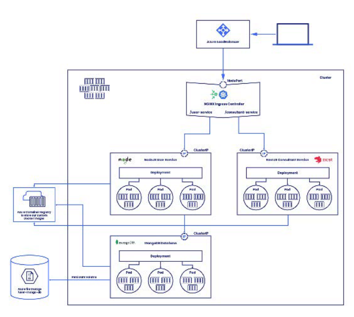

# Kubernetes Traffic Forwarding and Website Security with HTTPS

## Introduction

In a Kubernetes environment, understanding how network traffic is managed is crucial for building robust and scalable applications. This presentation will cover the fundamentals of internal and external traffic forwarding in Kubernetes, and demonstrate how to secure your applications with HTTPS using `cert-manager` and an Ingress controller.

## Kubernetes Networking Model

Kubernetes has a flat networking model, where every pod gets its own unique IP address and can communicate with any other pod in the cluster. This simplifies application development and deployment, as you don't have to worry about mapping ports between pods and nodes.

## Internal Traffic (East-West)

Internal traffic, also known as East-West traffic, is the communication between pods within the cluster. This is facilitated by **Services**.

### Services

A Service is an abstraction that defines a logical set of pods and a policy by which to access them. Services provide a stable IP address and DNS name for a set of pods, so you don't have to worry about the individual IP addresses of the pods, which can change.

### Internal Traffic Flow Diagram

```
+-----------------+      +-----------------+
|      Pod A      |----->|    Service B    |
+-----------------+      +-----------------+
                             |
                             v
                       +-----------+
                       |   Pod B   |
                       +-----------+
```

## External Traffic (North-South)

External traffic, also known as North-South traffic, is the communication between services within the cluster and the outside world. There are three main ways to expose services to external traffic:

*   **NodePort:** Exposes the service on each node's IP at a static port.
*   **LoadBalancer:** Creates an external load balancer in your cloud provider and assigns a fixed, external IP to the service.
*   **Ingress:** An API object that manages external access to the services in a cluster, typically for HTTP and HTTPS traffic.

### Ingress

Ingress is the most powerful and flexible way to expose services. It allows you to define routing rules based on hostname and path, and it can also handle TLS termination.

### External Traffic Flow Diagram (with Ingress)

```
                            +-------------------+
                            |  External Client  |
                            +-------------------+
                                      |
                                      v
                        +---------------------------+
                        |  External Load Balancer   |
                        +---------------------------+
                                      |
                                      v
+---------------------------------------------------------------------+
|                           Kubernetes Cluster                          |
|                                                                     |
|  +-----------------+      +-----------------+      +-----------------+  |
|  |      Node 1     |      |      Node 2     |      |      Node 3     |  |
|  |                 |      |                 |      |                 |  |
|  |  +-----------+  |      |  +-----------+  |      |  +-----------+  |  |
|  |  |  Ingress  |  |      |  |           |  |      |  |           |  |  |
|  |  | Controller|  |      |  |           |  |      |  |           |  |  |
|  |  +-----------+  |      |  |           |  |      |  |           |  |  |
|  |        |        |      |  |           |  |      |  |           |  |  |
|  |        v        |      |  |           |  |      |  |           |  |  |
|  |  +-----------+  |      |  |           |  |      |  |           |  |  |
|  |  |  Service  |  |      |  |           |  |      |  |           |  |  |
|  |  +-----------+  |      |  |           |  |      |  |           |  |  |
|  |        |        |      |  |           |  |      |  |           |  |  |
|  |        v        |      |  |           |  |      |  |           |  |  |
|  |  +-----------+  |      |  +-----------+  |      |  +-----------+  |  |
|  |  | Kube-proxy|  |      |  | Kube-proxy|  |      |  | Kube-proxy|  |  |
|  |  +-----------+  |      |  +-----------+  |      |  +-----------+  |  |
|  |   |     |     | |      |   |     |     | |      |   |     |     | |
|  |   v     v     v |      |   v     v     v |      |   v     v     v |
|  | +---+ +---+ +---+ |      | +---+ +---+ +---+ |      | +---+ +---+ +---+ |
|  | |Pod| |Pod| |Pod| |      | |Pod| |Pod| |Pod| |      | |Pod| |Pod| |Pod| |
|  | +---+ +---+ +---+ |      | +---+ +---+ +---+ |      | +---+ +---+ +---+ |
|  +-----------------+      +-----------------+      +-----------------+  |
|                                                                     |
+---------------------------------------------------------------------+
```

## Securing Your Website with HTTPS

To secure your website with HTTPS, you need to obtain a TLS certificate from a trusted Certificate Authority (CA) and configure your Ingress to use it. `cert-manager` is a popular tool that automates this process.

### `cert-manager`

`cert-manager` is a Kubernetes add-on that automates the management and issuance of TLS certificates from various issuing sources, including Let's Encrypt.

### HTTPS Flow with Ingress and `cert-manager`



## Practical Lab (Proof of Concept)

This lab will guide you through the process of deploying a sample application, configuring an Ingress, and securing it with HTTPS using `cert-manager`.

### 1. Deploy a Sample Application

```bash
kubectl create deployment nginx --image=nginx
kubectl expose deployment nginx --port=80
```

### 2. Deploy an Ingress Controller

We will use the NGINX Ingress Controller.

```bash
kubectl apply -f https://raw.githubusercontent.com/kubernetes/ingress-nginx/controller-v1.1.1/deploy/static/provider/cloud/deploy.yaml
```

### 3. Configure an Ingress Resource

Create a file named `ingress.yaml` with the following content:

```yaml
apiVersion: networking.k8s.io/v1
kind: Ingress
metadata:
  name: nginx-ingress
spec:
  rules:
  - host: your-domain.com
    http:
      paths:
      - path: /
        pathType: Prefix
        backend:
          service:
            name: nginx
            port:
              number: 80
```

Replace `your-domain.com` with your actual domain name and apply the manifest:

```bash
kubectl apply -f ingress.yaml
```

At this point, you should be able to access your NGINX server at `http://your-domain.com`.

### 4. Install `cert-manager`

```bash
kubectl apply -f https://github.com/cert-manager/cert-manager/releases/download/v1.7.1/cert-manager.yaml
```

### 5. Configure a ClusterIssuer

Create a file named `cluster-issuer.yaml` with the following content:

```yaml
apiVersion: cert-manager.io/v1
kind: ClusterIssuer
metadata:
  name: letsencrypt-prod
spec:
  acme:
    server: https://acme-v02.api.letsencrypt.org/directory
    email: your-email@your-domain.com
    privateKeySecretRef:
      name: letsencrypt-prod
    solvers:
    - http01:
        ingress:
          class: nginx
```

Replace `your-email@your-domain.com` with your email address and apply the manifest:

```bash
kubectl apply -f cluster-issuer.yaml
```

### 6. Update the Ingress Resource to Use TLS

Update your `ingress.yaml` file to include the TLS configuration:

```yaml
apiVersion: networking.k8s.io/v1
kind: Ingress
metadata:
  name: nginx-ingress
  annotations:
    cert-manager.io/cluster-issuer: letsencrypt-prod
spec:
  tls:
  - hosts:
    - your-domain.com
    secretName: nginx-tls
  rules:
  - host: your-domain.com
    http:
      paths:
      - path: /
        pathType: Prefix
        backend:
          service:
            name: nginx
            port:
              number: 80
```

Apply the updated manifest:

```bash
kubectl apply -f ingress.yaml
```

`cert-manager` will now automatically obtain a TLS certificate from Let's Encrypt and store it in a secret named `nginx-tls`. The Ingress controller will use this certificate to terminate TLS for your application.

### 7. Verification

After a few minutes, you should be able to access your NGINX server at `https://your-domain.com` and see a valid TLS certificate. You can check the status of the certificate request with the following command:

```bash
kubectl describe certificate nginx-tls
```

This concludes the presentation and practical lab on Kubernetes traffic forwarding and website security.
