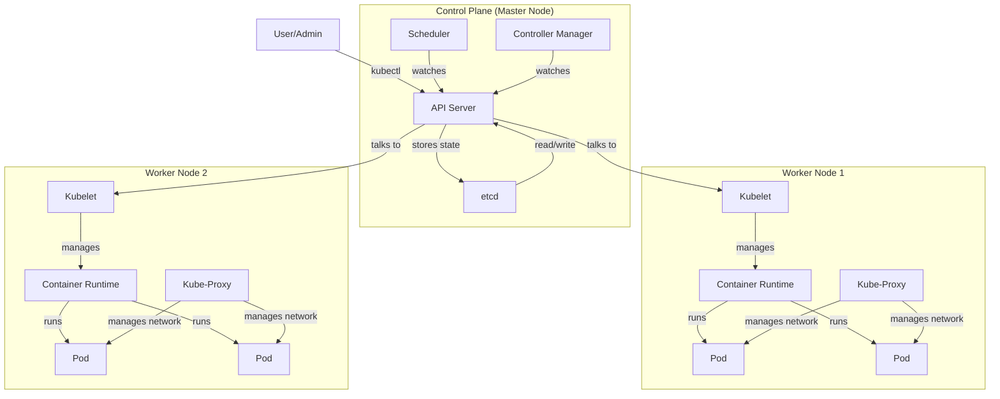
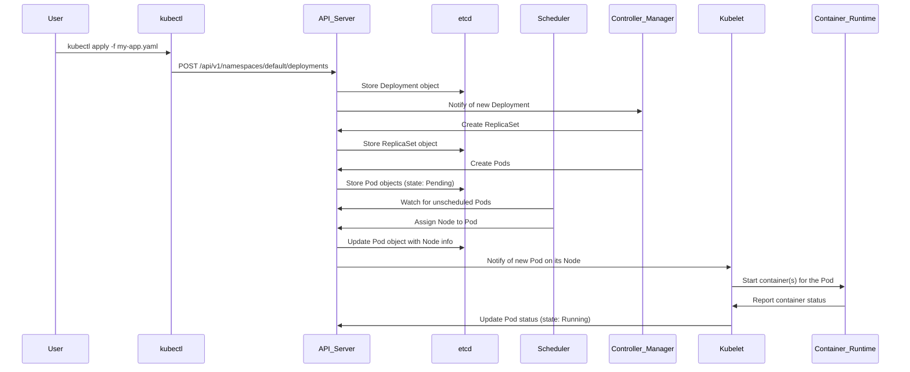

# Understanding Kubernetes

This document provides a comprehensive overview of Kubernetes, its architecture, and its core concepts.

## What is Kubernetes?

Kubernetes, often abbreviated as K8s, is an open-source container orchestration platform designed to automate the deployment, scaling, and management of containerized applications. Originally developed by Google, it is now maintained by the Cloud Native Computing Foundation (CNCF).

## The Problem: Managing Containers at Scale

While containerization tools like Docker are excellent for packaging and running individual applications in isolated environments, managing a large number of containers across multiple machines in a production environment presents significant challenges:

*   **Scalability:** How do you scale your application up or down based on demand?
*   **High Availability:** How do you ensure your application remains available if a container or a machine fails?
*   **Load Balancing:** How do you distribute network traffic evenly across multiple containers?
*   **Service Discovery:** How do containers find and communicate with each other?
*   **Updates and Rollbacks:** How do you roll out new versions of your application without downtime and roll back if something goes wrong?
*   **Storage:** How do you manage persistent data for stateful applications?

Kubernetes is designed to solve these problems by providing a robust framework for running distributed systems resiliently.

## Kubernetes Architecture

Kubernetes follows a client-server architecture with a master-worker model. A Kubernetes cluster consists of a set of worker machines, called **nodes**, that run containerized applications. Every cluster has at least one worker node. The worker node(s) host the **Pods** which are the components of the application workload. The **control plane** manages the worker nodes and the Pods in the cluster.

Here is a high-level overview of the Kubernetes architecture:



### Control Plane Components

The control plane is the brain of the Kubernetes cluster. It makes global decisions about the cluster (e.g., scheduling) and detects and responds to cluster events.

*   **API Server (`kube-apiserver`):** The API server is the front end for the Kubernetes control plane. It exposes the Kubernetes API, which is the primary way users, management devices, and other components interact with the cluster.
*   **etcd:** A consistent and highly-available key-value store used as Kubernetes' backing store for all cluster data.
*   **Scheduler (`kube-scheduler`):** The scheduler watches for newly created Pods that have no assigned node and selects a node for them to run on. Scheduling decisions are based on resource requirements, hardware constraints, and other policies.
*   **Controller Manager (`kube-controller-manager`):** The controller manager runs controller processes. These controllers are responsible for regulating the state of the cluster. For example, the Node controller is responsible for noticing and responding when nodes go down.

### Worker Node Components

Worker nodes are the machines (VMs, physical servers, etc.) where your applications run.

*   **Kubelet:** An agent that runs on each node in the cluster. It makes sure that containers are running in a Pod. The Kubelet takes its orders from the API server and ensures that the desired state of the containers on its node matches the state specified in the PodSpec.
*   **Kube-Proxy:** A network proxy that runs on each node in your cluster, implementing part of the Kubernetes Service concept. It maintains network rules on nodes. These network rules allow network communication to your Pods from network sessions inside or outside of your cluster.
*   **Container Runtime:** The software that is responsible for running containers. Kubernetes supports several container runtimes, such as Docker, containerd, and CRI-O.

## How Kubernetes Works: The Full Process

Here’s a step-by-step process of how Kubernetes manages containers, from a user's command to a running application.



1.  **User Defines Application State:** The user creates a YAML file (e.g., `my-app.yaml`) that defines the desired state of the application. This file describes a Kubernetes object, such as a `Deployment`, which specifies the container image to use, the number of replicas, and other configuration.

2.  **User Interacts with `kubectl`:** The user uses the `kubectl` command-line tool to send the YAML file to the Kubernetes API Server.
    ```bash
    kubectl apply -f my-app.yaml
    ```

3.  **API Server Receives Request:** the API Server validates the request and the YAML file.

4.  **State is Stored in `etcd`:** Upon successful validation, the API Server stores the desired state of the application in `etcd`. `etcd` is now the single source of truth for the cluster.

5.  **Controller Manager Acts:** The Controller Manager (specifically, the Deployment controller in this case) is constantly watching the API Server for changes. It notices the new `Deployment` object and its responsibility is to create a `ReplicaSet`. The `ReplicaSet` controller then creates the number of `Pod` objects defined in the `Deployment` manifest. The state of these pods in `etcd` is initially "Pending".

6.  **Scheduler Assigns Pods to Nodes:** The Scheduler is also watching the API Server. It sees the new Pods with a "Pending" state and no assigned node. The Scheduler's job is to find the best node for each Pod to run on, based on the Pod's resource requests and the available resources on the nodes. Once a suitable node is found, the Scheduler updates the Pod object in `etcd` with the assigned node name.

7.  **Kubelet Creates the Pod:** The `Kubelet` on the assigned worker node is watching the API Server. It sees that a Pod has been assigned to it. The `Kubelet` then instructs the Container Runtime (e.g., Docker) on its node to pull the specified container image and run the container(s) for the Pod.

8.  **Kube-Proxy Manages Networking:** `Kube-Proxy` on the worker node updates the network rules (e.g., iptables rules) to route traffic to the new Pod.

9.  **Continuous Monitoring:** The `Kubelet` continuously reports the status of the Pod and its containers back to the API Server, which updates the information in `etcd`. The control plane continuously monitors the cluster to ensure that the current state matches the desired state stored in `etcd`. If a Pod fails, the `ReplicaSet` controller will notice and create a new Pod to replace it, and the whole process starts again for the new Pod.

## Key Kubernetes Objects

*   **Pod:** The smallest and simplest unit in the Kubernetes object model that you create or deploy. A Pod represents a single instance of a running process in your cluster and can contain one or more containers.
*   **Service:** An abstract way to expose an application running on a set of Pods as a network service. With Kubernetes, you don't need to modify your application to use an unfamiliar service discovery mechanism.
*   **Volume:** Provides a way to manage storage for your applications. Kubernetes Volumes allow data to persist beyond the lifecycle of a Pod.
*   **Namespace:** A way to divide cluster resources between multiple users.
*   **Deployment:** A higher-level object that manages `ReplicaSets` and provides declarative updates to Pods.
*   **ReplicaSet:** Ensures that a specified number of Pod replicas are running at any given time.

This concludes the overview of Kubernetes.
