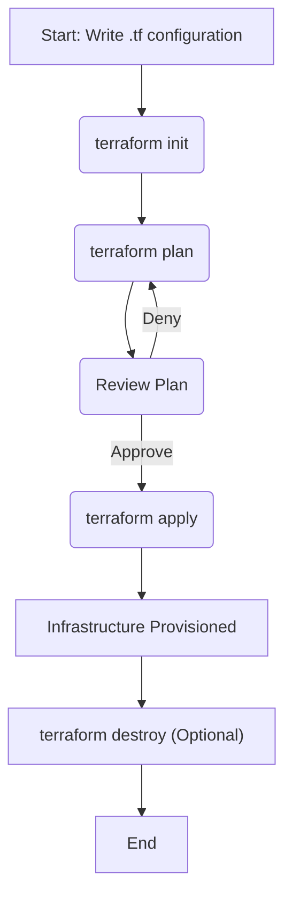

# Understanding Terraform

This document provides a comprehensive introduction to Terraform, an Infrastructure as Code (IaC) tool created by HashiCorp. It covers core concepts, the typical workflow, and provides examples to help you get started.

## What is Terraform?

Terraform is an open-source tool that allows you to define and provision infrastructure using a declarative configuration language. Instead of manually clicking through a web console to create servers, databases, and networks, you describe the desired state of your infrastructure in code. Terraform then works out how to achieve that state.

**Key Characteristics:**

*   **Declarative:** You describe *what* you want, not *how* to create it. For example, "I want a server with these specifications," not "Click this button, then this, then fill out this form."
*   **Stateful:** Terraform maintains a state file to keep track of the real-world resources it manages. This allows it to plan and apply changes accurately.
*   **Extensible (Providers):** It uses a plugin-based architecture called "providers" to manage a vast range of infrastructure platforms, from public clouds (AWS, Azure, Google Cloud) to on-premises solutions (vSphere) and other services (Kubernetes, Cloudflare).

## Core Concepts

### 1. Providers

Providers are plugins that Terraform uses to interact with a specific API. If you want to create resources in AWS, you use the `aws` provider. If you want to manage resources in Kubernetes, you use the `kubernetes` provider.

```terraform
terraform {
  required_providers {
    aws = {
      source  = "hashicorp/aws"
      version = "~> 4.0"
    }
  }
}

provider "aws" {
  region = "us-west-2"
}
```

### 2. Resources

Resources are the fundamental building blocks of your infrastructure. They represent a specific object, like a virtual machine, a database instance, or a DNS record.

```terraform
# An AWS EC2 instance resource
resource "aws_instance" "web_server" {
  ami           = "ami-0c55b159cbfafe1f0" # Amazon Machine Image
  instance_type = "t2.micro"

  tags = {
    Name = "MyWebServer"
  }
}
```

### 3. State

State is how Terraform maps the resources defined in your code to the actual resources in the real world. When you run Terraform, it creates a file (usually `terraform.tfstate`) that stores this mapping. This file is crucial for Terraform to know what it is managing, what changes to make, and how to destroy the resources later.

**The role of the state file:**

*   **Mapping:** Connects resource names in your code to their IDs on the platform.
*   **Planning:** Helps Terraform determine which resources need to be created, updated, or deleted.
*   **Dependency Tracking:** Records dependencies between resources.

### 4. Input Variables

Input variables (like function arguments) allow you to create reusable and configurable Terraform code. You can define variables and then provide values for them when you run Terraform.

```terraform
# Define a variable
variable "instance_type" {
  description = "The type of EC2 instance to create."
  type        = string
  default     = "t2.micro"
}

# Use the variable
resource "aws_instance" "web_server" {
  ami           = "ami-0c55b159cbfafe1f0"
  instance_type = var.instance_type # Reference the variable
}
```

### 5. Output Values

Output values (like function return values) allow you to extract information from your infrastructure after it has been created. For example, you can output the IP address of a server or the connection string for a database.

```terraform
output "ip_address" {
  description = "The public IP address of the web server."
  value       = aws_instance.web_server.public_ip
}
```

## The Terraform Workflow

The standard Terraform workflow consists of three main commands: `init`, `plan`, and `apply`.



1.  **`terraform init`**: Initializes the working directory. This command does two main things:
    *   **Downloads Providers:** It finds the `provider` blocks in your code and downloads the necessary plugins.
    *   **Backend Initialization:** It sets up the backend where the state file will be stored (by default, this is a local file called `terraform.tfstate`).

2.  **`terraform plan`**: Creates an execution plan. Terraform compares the desired state in your code with the current state in your `terraform.tfstate` file and the real-world infrastructure. It then shows you what changes it will make:
    *   **`+` Create:** Resources that will be created.
    *   **`-` Destroy:** Resources that will be deleted.
    *   **`~` Update:** Resources that will be modified in-place.

3.  **`terraform apply`**: Applies the changes. This command executes the plan generated by `terraform plan`. It will prompt for confirmation before making any changes. Once you approve, it will create, update, or delete resources as planned and then update the `terraform.tfstate` file.

4.  **`terraform destroy`**: Destroys all the resources managed by the Terraform configuration. It will also ask for confirmation before proceeding.

## Example: Creating a Local File

Here is a simple example of how to use Terraform to create a local file named `hello.txt`.

**1. Create a file named `main.tf`:**

```terraform
terraform {
  required_providers {
    local = {
      source = "hashicorp/local"
      version = "2.1.0"
    }
  }
}

resource "local_file" "hello" {
  content  = "Hello, Terraform!"
  filename = "${path.module}/hello.txt"
}
```

**2. Initialize Terraform:**

```bash
terraform init
```

**3. Plan the changes:**

```bash
terraform plan
```

*Output:*
```
Terraform will perform the following actions:

  # local_file.hello will be created
  + resource "local_file" "hello" {
      + content              = "Hello, Terraform!"
      + directory_permission = "0777"
      + file_permission      = "0777"
      + filename             = "./hello.txt"
      + id                   = (known after apply)
    }

Plan: 1 to add, 0 to change, 0 to destroy.
```

**4. Apply the changes:**

```bash
terraform apply
```

After you type `yes`, Terraform will create the `hello.txt` file in the same directory.

**5. Destroy the resource:**

```bash
terraform destroy
```

This will delete the `hello.txt` file.
